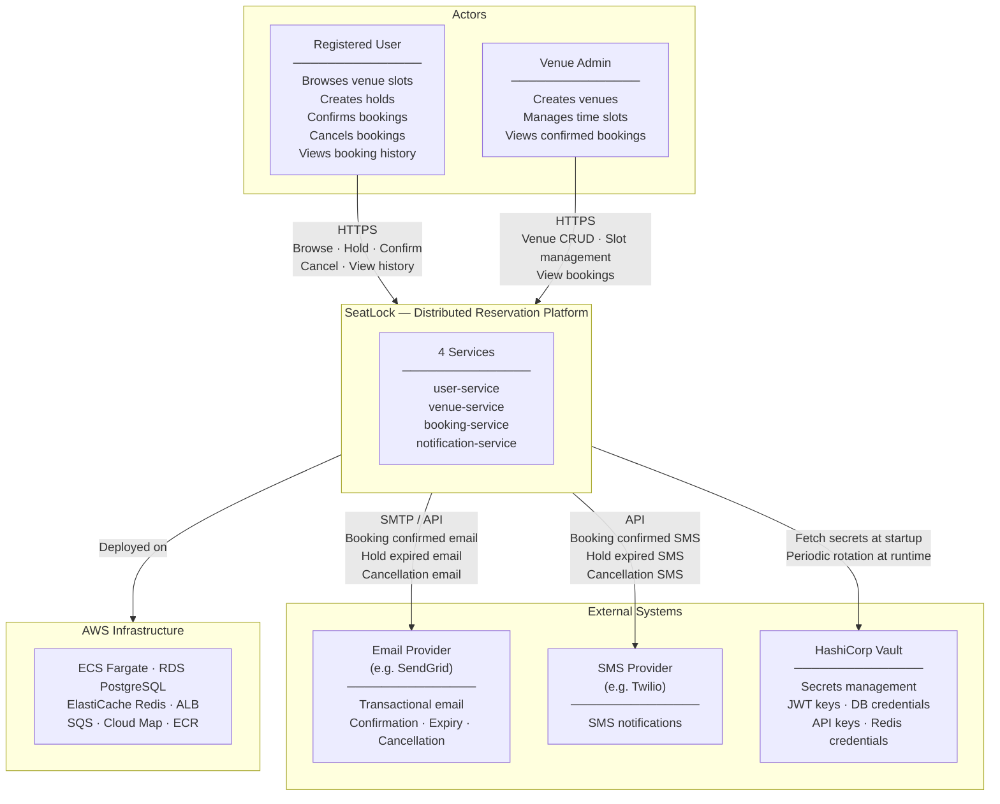

# Diagram 01 — System Context

## Overview

SeatLock as a black box — who uses it and what external systems it depends on.

---

## External Actor Summary

| Actor | Type | Interactions |
|-------|------|-------------|
| Registered User | Human | Browse slots, create holds, confirm bookings, cancel bookings, view booking history |
| Venue Admin | Human | Create/deactivate venues, manage slots, view confirmed bookings |
| Email Provider | External system | Receives send requests from notification-service via SMTP or REST API |
| SMS Provider | External system | Receives send requests from notification-service via REST API |
| HashiCorp Vault | External system | Provides secrets at startup; supports runtime secret rotation |
| AWS | Cloud platform | Provides all compute, storage, networking, and messaging infrastructure |

---

## What SeatLock Does Not Own

| Concern | Out of scope | Notes |
|---------|-------------|-------|
| Payment processing | ✗ | Booking confirmation is the terminal action; payment is a future phase |
| Email/SMS delivery infrastructure | ✗ | Delegated to third-party providers |
| Identity providers (OAuth, SSO) | ✗ | Phase 0 uses JWT with internal user registry only |
| Venue physical access control | ✗ | SeatLock issues a confirmation number; physical enforcement is the venue's concern |
