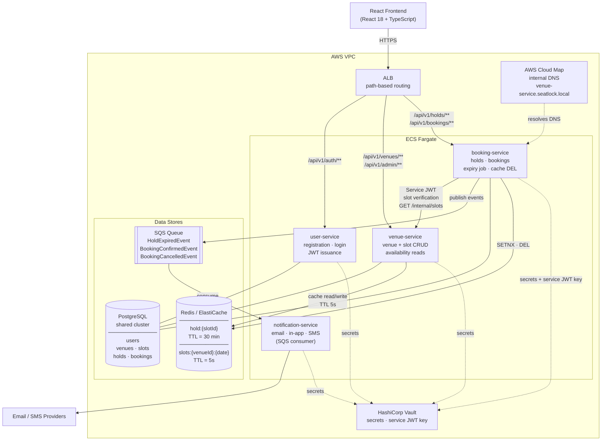

# Diagram 02 — Service Architecture

> Phase 0 — Design Only
> Reflects all decisions made through Section 5 (High-Level Design).
> See `docs/system-design/05-high-level-design.md` for full decision rationale.

---

## Service Architecture Diagram

---

## Communication Key

| Arrow style | Meaning |
|-------------|---------|
| Solid `-->` | Synchronous HTTP or direct I/O |
| Dotted `-.->` | Configuration / secret fetch (startup or periodic) |

| Label | Detail |
|-------|--------|
| Service JWT | booking-service signs `sub: booking-service` JWT with Vault-sourced secret; venue-service validates |
| SETNX · DEL | `SET hold:{slotId} NX EX 1800` (hold creation); `DEL` on confirm/cancel/hold |
| cache read/write | `GET slots:{venueId}:{date}` on browse; `SET ... EX 5` on miss; `DEL` triggered by booking-service |
| publish events | booking-service publishes after hold expiry, booking confirmation, booking cancellation |

---

## What Changed From Early Sketches

| Sketch assumption | Final decision |
|-------------------|---------------|
| API Gateway / Auth layer at the edge | Single ALB with path-based rules — no API Gateway needed at 10k DAU |
| Separate Reservation Service | Split into booking-service (holds + bookings) and venue-service (venues + slots + availability) |
| No cache layer shown | Redis/ElastiCache: holds (30min TTL) + availability cache (5s TTL) |
| No async messaging shown | SQS queue between booking-service and notification-service |
| No secrets management shown | HashiCorp Vault for all services; service JWT key for inter-service auth |
| No service discovery shown | AWS Cloud Map: ECS tasks auto-register; stable internal DNS |
