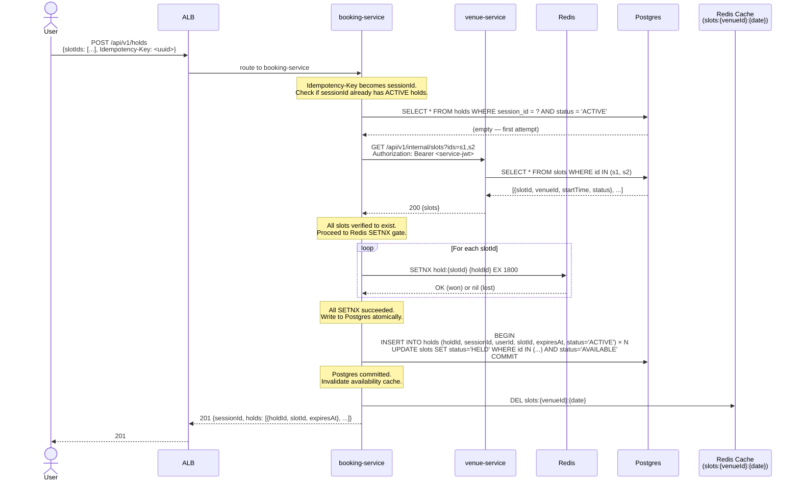
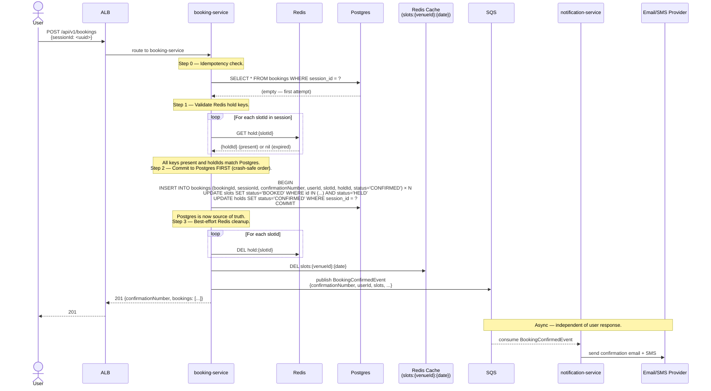
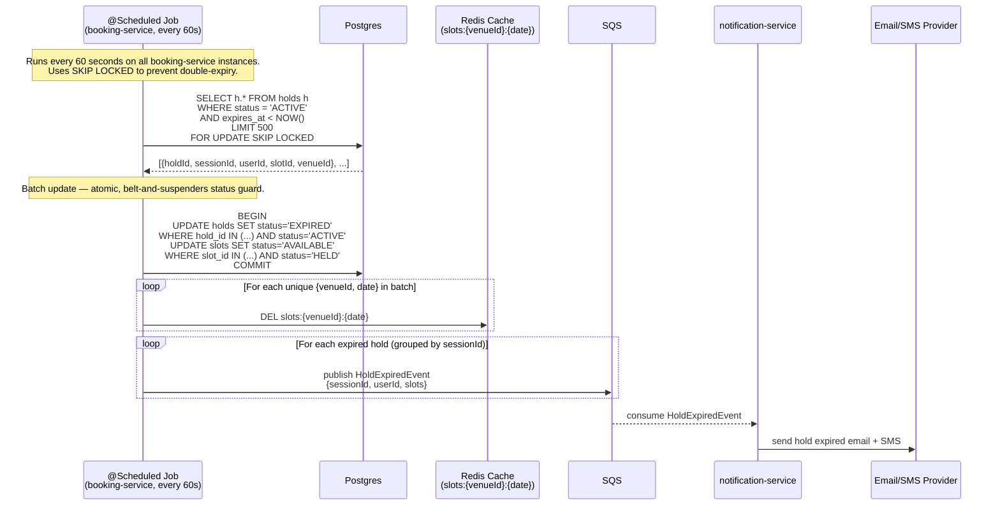

# Diagram 03 — Booking Flow Sequence

## Overview

Three sequence diagrams covering the core booking lifecycle:
1. Hold Creation (happy path)
2. Booking Confirmation (happy path — crash-safe operation order)
3. Hold Expiry (background job)

All flows originate from booking-service. venue-service handles availability reads separately (not shown here — see data flow doc).

---

## Flow 1 — Hold Creation

**Failure paths (not shown):**
- Any SETNX returns nil → release any Redis keys already won → return 409 `SLOT_NOT_AVAILABLE`
- slot UPDATE row count mismatch → return 409 `SLOT_NOT_AVAILABLE` (secondary Postgres guard)
- venue-service unreachable → return 503

---

## Flow 2 — Booking Confirmation

**Failure paths (not shown):**
- Any Redis key missing → return 409 `HOLD_EXPIRED`
- holdId in Redis doesn't match Postgres → return 409 `HOLD_MISMATCH`
- Crash after Postgres commits, before Redis DEL → retry hits step 0 idempotency check → returns 201 with existing data

---

## Flow 3 — Hold Expiry (Background Job)

**Notes:**
- `SKIP LOCKED` prevents multiple booking-service instances from processing the same holds
- On deadlock or timeout: retry up to 3× with exponential backoff; halve batch size on repeated failure
- Redis hold keys (`hold:{slotId}`) expire naturally via TTL; the job does not DEL them — they are already expired
