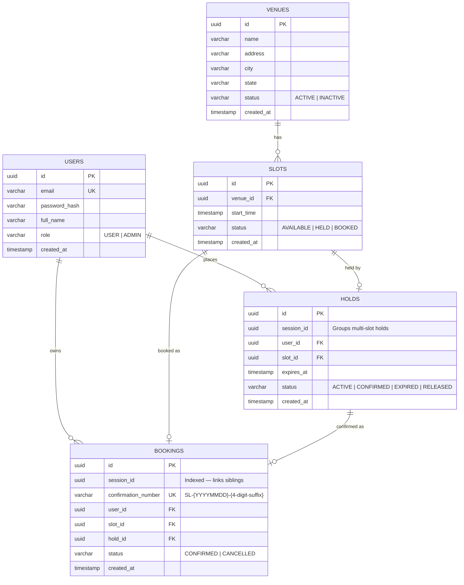

# Diagram 04 — Data Model ERD

## Overview

Entity-relationship diagram for all five Postgres tables. booking-service and venue-service share the same Postgres cluster in Phase 0 — ownership is enforced at the application layer.

---

## ERD

---

## Table Notes

### USERS
- `role` is a string enum: `USER` or `ADMIN`
- Owned exclusively by **user-service**
- No hard deletes — user deactivation is a Phase 1+ concern

### VENUES
- `status` controls visibility: `INACTIVE` venues are hidden from browse but bookings are preserved
- Owned exclusively by **venue-service**
- Soft-delete only (no `DELETE` statements)

### SLOTS
- `start_time` stored in UTC; `end_time` is derived: `start_time + seatlock.slot.duration-minutes`
- `status` is owned by **venue-service** for metadata; `status` column is written by **booking-service** (Phase 0 shared cluster compromise)
- One slot = one booking (capacity = 1)
- Auto-generated Mon–Fri, 09:00–17:00, 1h blocks per venue

### HOLDS
- `session_id` groups all holds created in a single `POST /holds` call (shared across N holds per multi-slot transaction)
- `expires_at` = `created_at + 30 minutes`
- Terminal states: `CONFIRMED` (booking created), `EXPIRED` (expiry job ran), `RELEASED` (booking cancelled)
- Redis key `hold:{slotId}` mirrors this record during the `ACTIVE` window; deleted on confirmation

### BOOKINGS
- `session_id` is stored redundantly (denormalized) alongside `confirmation_number` to avoid joins back through the HOLDS table when querying siblings
- `confirmation_number` is the **user-facing** booking reference; `session_id` is the **internal** transaction identity
- One `confirmation_number` per session, shared across all N booking records in a multi-slot transaction
- `hold_id` references the originating hold for audit purposes

---

## Key Indexes

| Table | Index | Purpose |
|-------|-------|---------|
| USERS | `email` (unique) | Login lookup |
| SLOTS | `venue_id, start_time` | Slot browsing by venue + date |
| SLOTS | `status` | Availability filtering |
| HOLDS | `session_id` | Multi-slot hold lookup |
| HOLDS | `status, expires_at` | Expiry job polling |
| HOLDS | `slot_id` | Hold lookup by slot |
| BOOKINGS | `session_id` | Sibling booking lookup |
| BOOKINGS | `confirmation_number` (unique) | Cancel and history lookup |
| BOOKINGS | `user_id` | Booking history by user |

---

## Service Ownership by Table

| Table | Owned by | Written by |
|-------|----------|-----------|
| users | user-service | user-service |
| venues | venue-service | venue-service |
| slots (all columns except status) | venue-service | venue-service |
| slots.status | venue-service (Phase 0: written by booking-service) | booking-service |
| holds | booking-service | booking-service |
| bookings | booking-service | booking-service |
