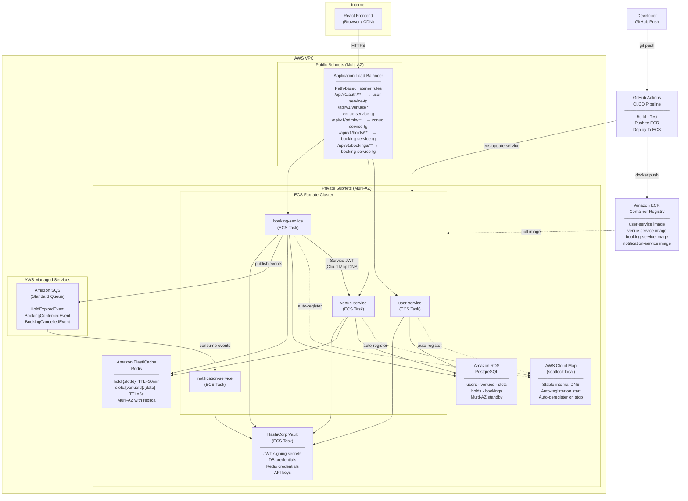

# Diagram 05 — Infrastructure

## Overview

AWS infrastructure topology for SeatLock. All application workloads run inside a single VPC. Public-facing traffic enters through a single ALB. Services communicate internally via AWS Cloud Map DNS.

---

## Infrastructure Diagram

---

## Infrastructure Components

| Component | AWS Service | Purpose |
|-----------|------------|---------|
| Compute | ECS Fargate | Serverless containers — no EC2 management |
| Load balancing | Application Load Balancer | Single public entry point; path-based routing |
| Database | RDS PostgreSQL (Multi-AZ) | Source of truth; ACID guarantees |
| Cache / Holds | ElastiCache Redis (with replica) | Sub-ms SETNX for holds; availability cache |
| Messaging | SQS Standard Queue | Async booking → notification events |
| Service discovery | AWS Cloud Map | Internal DNS (`*.seatlock.local`); ECS-native |
| Container registry | Amazon ECR | Stores built service images |
| Secrets | HashiCorp Vault | Dynamic secrets and rotation |
| CI/CD | GitHub Actions | Build, test, push, deploy on every merge to main |

---

## Network Boundaries

| Traffic | Path | Notes |
|---------|------|-------|
| External users → services | Internet → ALB → ECS (private subnet) | ALB terminates TLS; backend is HTTP inside VPC |
| Service-to-service | Cloud Map DNS (private subnet) | Never leaves VPC |
| Services → RDS | Private subnet | Security group allows port 5432 from ECS tasks only |
| Services → Redis | Private subnet | Security group allows port 6379 from ECS tasks only |
| booking-service → SQS | AWS-managed (VPC endpoint optional) | Standard SQS API |
| Services → Vault | Private subnet | Vault on ECS within same VPC |
| CI/CD → ECR / ECS | GitHub Actions → AWS API | IAM role via OIDC federation |

---

## High Availability

| Component | HA Strategy |
|-----------|------------|
| ECS tasks | Multiple tasks per service; ECS replaces failed tasks automatically |
| ALB | Multi-AZ by default |
| RDS | Multi-AZ standby; automatic failover |
| ElastiCache | Primary + read replica; automatic failover |
| SQS | Managed; inherently durable |
| Vault | Single ECS task in Phase 0; HA Vault cluster is Phase 1+ |
